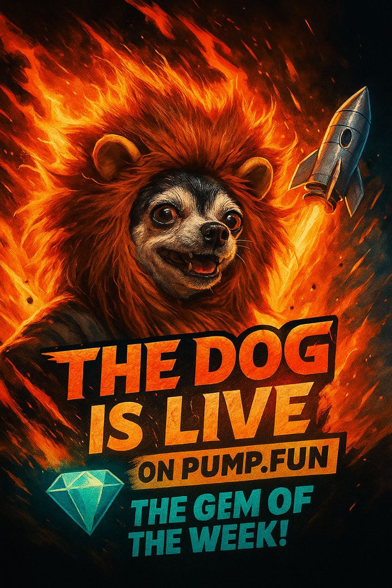

<!DOCTYPE html>
<html lang="de">
<head>
  <meta charset="UTF-8">
  <meta name="viewport" content="width=device-width,initial-scale=1.0">
  <title>THEDOG — DeFi Revolution</title>
  
</head>
<body>
  

    <header>
      
      <h1>THEDOG — Born to Dominate DeFi</h1>
      

        In einer Welt voller leerer Krypto-Versprechen steigt THEDOG auf mit echtem Power, Geschwindigkeit und Community-Vertrauen. Mehr als ein Token — THEDOG ist ein Statement für Innovation, Stärke und Freiheit. 
        Join the swarm. Own the future. Rule the chain.
      

    </header>
    <div class="features
